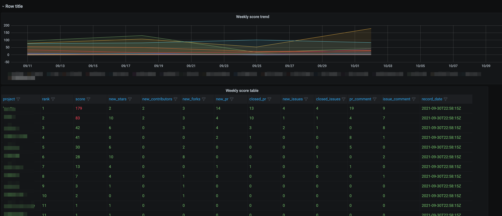
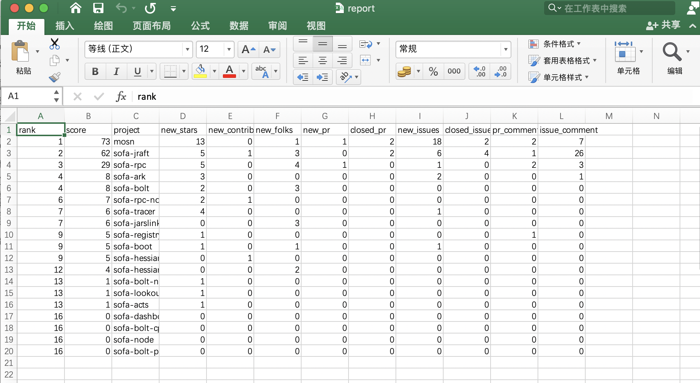
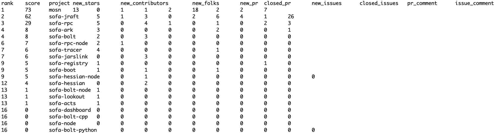
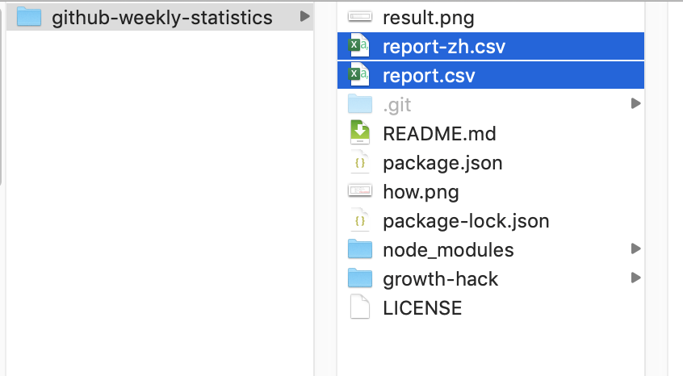
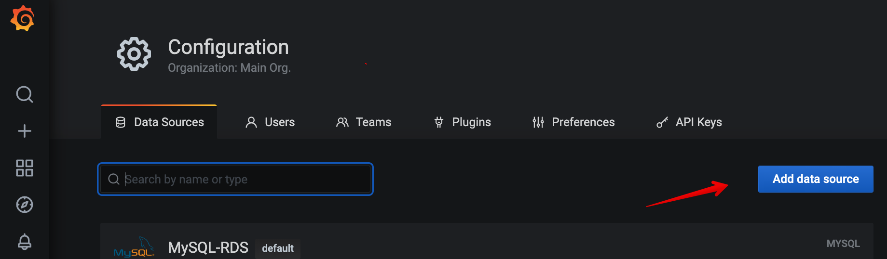

# Github Growth Hack

[中文文档](README.md)

A framework to help you do growth hacking for your open source projects.

## Motivation

This project wants to solve these problems:

- Push

How to make the project owners invest more man-days in their open source projects?

- Efficiency improvement

How to automate some chores and save some technical man-days?

- Planning

Given the limited resource of technical man-days,what should we do to (try to) maximize the benefits?

## Features

It can:

1. Generate a weekly or monthly report for the github projects you care about

- calculate an "activity score" for every project
- use the scores to rank these projects
- send the report to IM group
- have a dashboard to show them

Screenshots of the dashboard and reports:






2. Find those issues without any comments and warn you


Screenshots of the warnings:


## Usage

### Generate Weekly Report as Excel

0. clone the repo

```bash
git clone https://github.com/seeflood/github-weekly-statistics.git
```

1. Modify the configuration options in `src/index.js`

```javascript
// Modify these configuration items as you like
// 1. Your github API token
// We use your token to invoke github graphql api to query some repo data and won't do any modification.
// see https://docs.github.com/en/graphql/guides/forming-calls-with-graphql#authenticating-with-graphql
const token = ``;

// 2. Time range.
// modify it as you like
// e.g.
// let since = `2021-06-12T00:32:13Z`;
// let since = utils.lastSunday();
// let since = `2021-10-09T00:32:13Z`;
let since = utils.sevenDaysBefore();
// let to = utils.thisFriday23_59_59();
let to = utils.today();

// 3. Which repositries do you care about?
// Parameters in the repos array are:
// [owner, repo]
let repos = [
  ["mosn", "mosn"],
  ["mosn", "layotto"],
];

// 4. (Optional) Send messages to dingtalk group
const dingTalkGroupConfig = {
  url: "",
  keyword: "",
  owners: new Map(),
};

dingTalkGroupConfig.owners.set("project name", "dingtalk uid");
dingTalkGroupConfig.owners.set("layotto", "193555");
```

2. Run it

```bash
# install packages
npm install
npm run week
```

3. Now you have the weekly report for your repositories!

   

   Check the generated .csv files:

   

   You can open them with Excel:

   

### Send issue warning to dingtalk group

1. Modify the configuration options in `src/index.js`

2. Run `npm run scan`

### Generate Weekly Report as Grafana Dashboard

To generate a Grafana Dashboard,you have to load the `report.csv` data into a MYSQL table and start a Grafana server integrated with the MYSQL table.

1. Create a MYSQL Table

```SQL
CREATE TABLE `github_repo_weekly` (
  `id` int(11) unsigned NOT NULL AUTO_INCREMENT,
  `date_from` datetime DEFAULT NULL,
  `date_to` datetime DEFAULT NULL,
  `record_date` datetime DEFAULT NULL,
  `rank` int(11) NOT NULL,
  `score` int(11) DEFAULT NULL,
  `owner` varchar(40) DEFAULT NULL,
  `project` varchar(100) DEFAULT NULL,
  `new_stars` int(11) DEFAULT NULL,
  `new_contributors` int(11) DEFAULT NULL,
  `new_forks` int(11) DEFAULT NULL,
  `new_pr` int(11) DEFAULT NULL,
  `closed_pr` int(11) DEFAULT NULL,
  `new_issues` int(11) DEFAULT NULL,
  `closed_issues` int(11) DEFAULT NULL,
  `pr_comment` int(11) DEFAULT NULL,
  `issue_comment` int(11) DEFAULT NULL,
  PRIMARY KEY (`id`)
) ENGINE=InnoDB DEFAULT CHARSET=utf8 AVG_ROW_LENGTH=150 ROW_FORMAT=DYNAMIC COMMENT='github_repo_weekly'
;

```

2. Run a Grafana server and add the MYSQL Table as a new datasource.
   

3. Set up your Grafana dashboard using the config file [grafana/dashboard.json](grafana/dashboard.json)

4. Set up the configuration in `src/index.js`(see above).

Make sure you have set the mysql config:
```
// (Optional) Write the reports into Mysql
let mysqlConfig = {
  host: "",
  user: "",
  password: "",
  database: "",
};
```

5. Run it

```bash
# install packages
npm install
npm run week
```

6. Open your Grafana Dashboard:
   

### Generate "Monthly Active Contributors(MAC)" report as Excel

```bash
npm run month
```

### Scan issues without any comments for at least 5 days

```
npm run scan
```

## Rationale

### How is the 'score' calculated?

Based on the [formula](http://oss.x-lab.info/github-insight-report-2020.pdf) proposed by [open-digger](https://github.com/X-lab2017/open-digger),but I add some new factors

 
 